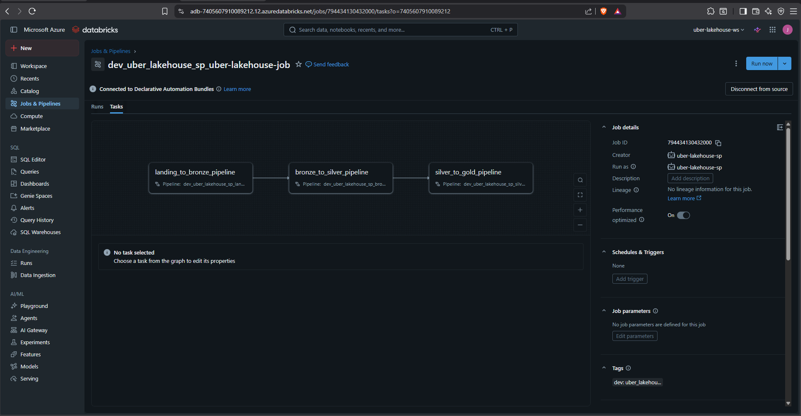
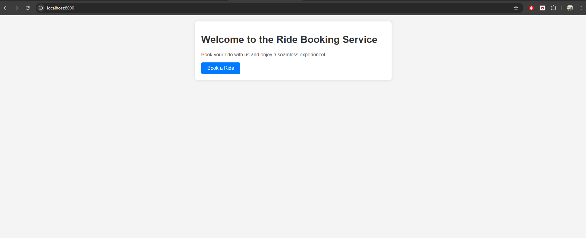
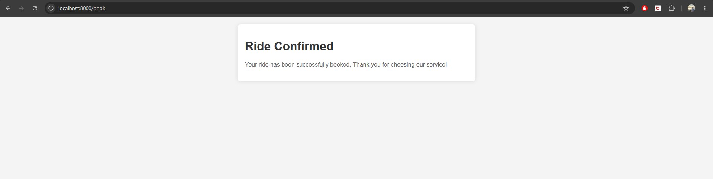
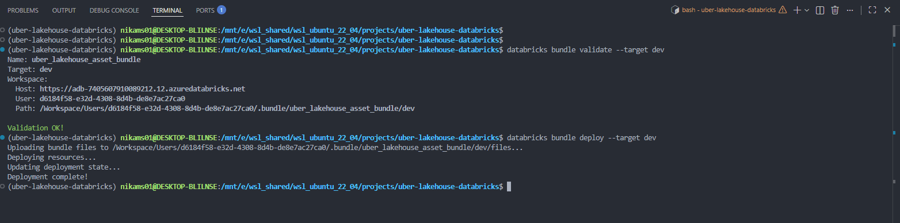
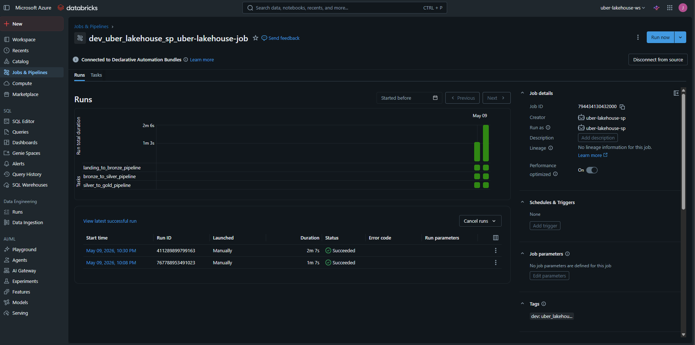
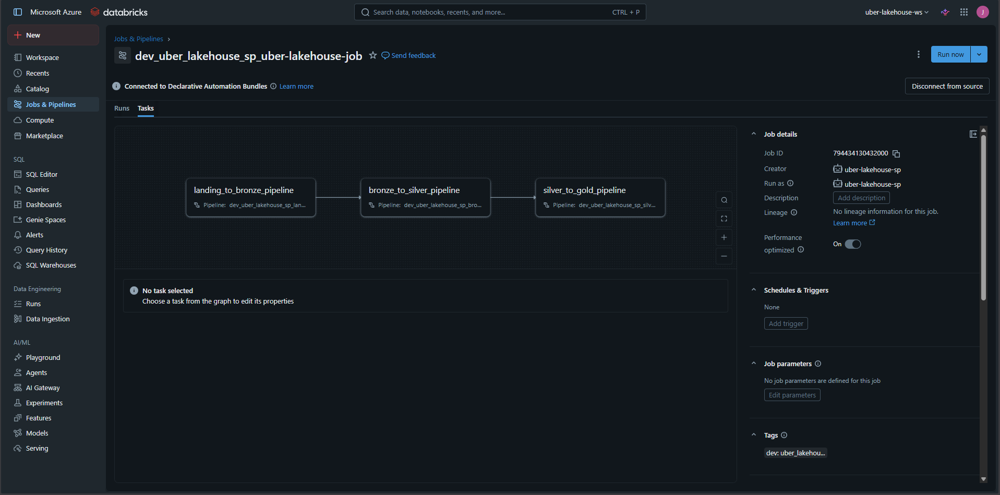
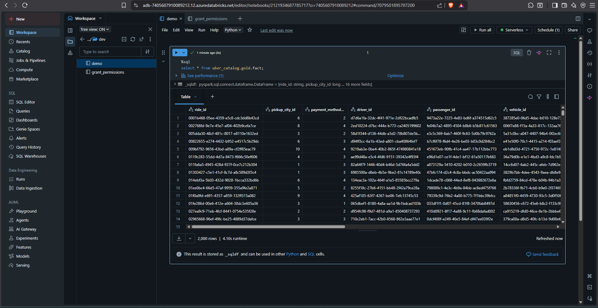

# Uber Lakehouse on Databricks

End-to-end demo of an Uber-style ride-data lakehouse on Azure Databricks. Synthetic ride events are produced by a FastAPI app, streamed through Azure Event Hubs, then ingested and progressively refined through bronze, silver, and gold layers using Lakeflow Declarative Pipelines (formerly Delta Live Tables). The whole platform is defined and deployed via Databricks Asset Bundles.


> _Placeholder: high-level architecture diagram (FastAPI → Event Hubs → Landing → Bronze → Silver → Gold)._

---

## Architecture

The pipeline follows the **medallion architecture**:

| Layer  | Source                                  | Schema  | Purpose                                              |
|--------|-----------------------------------------|---------|------------------------------------------------------|
| Landing| Azure Event Hubs + raw JSON files       | —       | Untouched event/file ingest                          |
| Bronze | Landing                                 | bronze  | Append-only raw tables in Delta                      |
| Silver | Bronze                                  | silver  | Cleaned, conformed, joined OBT (one big table)       |
| Gold   | Silver                                  | gold    | Business-ready aggregates / models                   |

Each transition is its own Lakeflow Declarative Pipeline; they are chained by a single Databricks Job.


> _Placeholder: screenshot of the job DAG in Databricks (landing_to_bronze → bronze_to_silver → silver_to_gold)._

---

## Tech Stack

- **Azure Databricks** — Unity Catalog (`uber_catalog`), serverless compute, Photon
- **Lakeflow Declarative Pipelines** — streaming + batch transformations
- **Databricks Asset Bundles (DABs)** — infra-as-code for jobs, pipelines, permissions
- **Azure Event Hubs** — streaming source for ride events
- **FastAPI + Faker** — synthetic ride-event producer
- **Python 3.12**, managed with `uv`

---

## Project Structure

```
uber-lakehouse-databricks/
├── databricks.yml               # Bundle root (dev/prod targets, vars)
├── resources/
│   ├── jobs/
│   │   └── uber_lakehouse_job.yml      # Orchestrates the 3 pipelines
│   └── pipelines/
│       ├── lading_to_bronze.yml
│       ├── bronze_to_silver.yml
│       └── silver_to_gold.yml
├── src/
│   ├── api.py                          # FastAPI booking endpoints
│   ├── connection.py                   # Event Hub producer
│   ├── data.py                         # Synthetic ride generator (Faker)
│   └── pipelines/
│       ├── landing_to_bronze/transformations/
│       │   ├── ingest_event_hub.py
│       │   └── ingest_raw_files.py
│       ├── bronze_to_silver/transformations/
│       │   ├── bulk_stream_cmbine_tbl_load.py
│       │   ├── silver_obt_query_prep.py
│       │   └── silver_obt.sql
│       └── silver_to_gold/transformations/
│           └── model.py
├── data/                               # Mapping JSONs (cities, vehicles, etc.)
├── templates/                          # Booking UI templates
├── pyproject.toml
└── .env.template
```


> _Placeholder: VS Code / Cursor screenshot showing the folder tree._

---

## Prerequisites

- Azure subscription with an **Event Hubs** namespace
- **Azure Databricks** workspace with Unity Catalog enabled and a catalog named `uber_catalog` (or update `databricks.yml`)
- [Databricks CLI](https://docs.databricks.com/dev-tools/cli/install.html) `>= 0.220`
- Python 3.12 and [`uv`](https://docs.astral.sh/uv/)

---

## Setup

### 1. Clone & install

```bash
git clone <repo-url>
cd uber-lakehouse-databricks
uv sync
```

### 2. Configure environment

Copy the template and fill in your Event Hubs credentials:

```bash
cp .env.template .env
```

```dotenv
CONNECTION_STRING=<event-hubs-connection-string>
EVENT_HUBNAME=<event-hub-name>
```

### 3. Authenticate to Databricks

```bash
databricks auth login --host https://adb-7405607910089212.12.azuredatabricks.net
```


> _Placeholder: terminal output of successful `databricks auth login`._

---

## Running the Producer Locally

The FastAPI app exposes a booking endpoint that pushes a synthetic ride event onto Event Hubs.

```bash
uv run uvicorn src.api:app --host 0.0.0.0 --port 8000 --reload
```

Then open <http://localhost:8000>. Each click on **Book** sends a fresh ride confirmation to the configured Event Hub.


> _Placeholder: booking home page._


> _Placeholder: ride confirmation page after booking._

---

## Deploying the Bundle

Validate, deploy, and run from the project root.

### Dev target (default)

```bash
databricks bundle validate
databricks bundle deploy --target dev
databricks bundle run uber_lakehouse_job --target dev
```

Dev deployments are prefixed with `dev_<your-username>_` and have schedules paused.

### Prod target

```bash
databricks bundle deploy --target prod
databricks bundle run uber_lakehouse_job --target prod
```


> _Placeholder: terminal output of `databricks bundle deploy`._

---

## Pipelines & Job

The job `uber-lakehouse-job` runs three pipeline tasks in sequence:

1. `landing_to_bronze_pipeline` — Event Hubs stream + raw JSON ingest into `uber_catalog.bronze`
2. `bronze_to_silver_pipeline` — Cleansed/joined OBT in `uber_catalog.silver`
3. `silver_to_gold_pipeline` — Business-ready models in `uber_catalog.gold`

Tasks reference pipelines via DAB substitution, so the same YAML works across `dev` and `prod`:

```yaml
pipeline_id: ${resources.pipelines.pipeline_landing_to_bronze.id}
```


> _Placeholder: Databricks Jobs UI showing the successful run with three task nodes._


> _Placeholder: Lakeflow pipeline DAG for one of the pipelines (e.g. landing_to_bronze)._

---

## Querying the Lakehouse

Once the job has completed, the medallion tables are available in Unity Catalog:

```sql
SELECT * FROM uber_catalog.bronze.rides_event_hub LIMIT 10;
SELECT * FROM uber_catalog.silver.rides_obt LIMIT 10;
SELECT * FROM uber_catalog.gold.<model_table> LIMIT 10;
```


> _Placeholder: Databricks SQL editor showing query results from a gold table._

---

## Targets

Defined in [databricks.yml](databricks.yml):

| Target | Mode        | Catalog            | Schema |
|--------|-------------|--------------------|--------|
| `dev`  | development | `uber_catalog`     | `dev`  |
| `prod` | production  | `uber_catalog_prod`| `prod` |

> Catalogs share a Unity Catalog metastore namespace, so dev and prod must use **distinct** catalog names — `uber_catalog` for dev and `uber_catalog_prod` for prod.

---

## Adding Screenshots

Drop PNGs into `docs/screenshots/` using the filenames referenced above. The placeholders will resolve automatically once the files exist.

```bash
mkdir -p docs/screenshots
```
