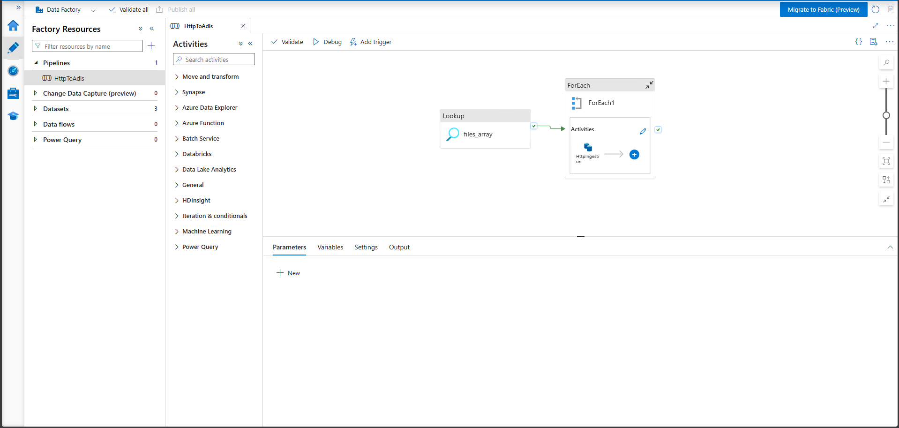
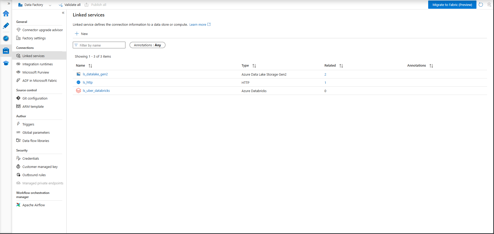
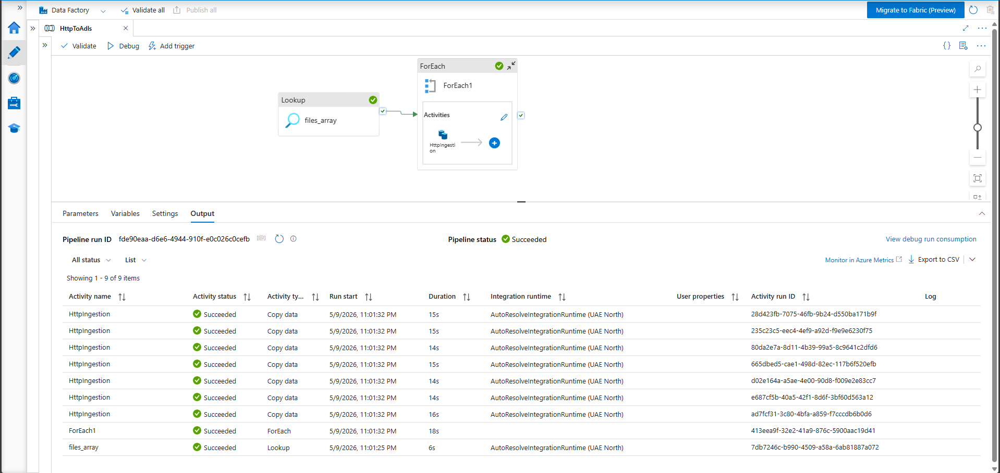

# Uber Lakehouse on Databricks

End-to-end demo of an Uber-style ride-data lakehouse on Azure Databricks. Synthetic ride events are produced by a FastAPI app, streamed through Azure Event Hubs, while reference/bulk JSON files are landed into ADLS Gen2 via **Azure Data Factory**. Data is then ingested and progressively refined through bronze, silver, and gold layers using Lakeflow Declarative Pipelines (formerly Delta Live Tables). The whole platform is defined and deployed via Databricks Asset Bundles.

---

## Architecture

The pipeline follows the **medallion architecture**:

| Layer  | Source                                          | Schema  | Purpose                                              |
|--------|-------------------------------------------------|---------|------------------------------------------------------|
| Landing| Azure Event Hubs + ADLS Gen2 raw files (via ADF)| —       | Untouched event/file ingest                          |
| Bronze | Landing                                         | bronze  | Append-only raw tables in Delta                      |
| Silver | Bronze                                          | silver  | Cleaned, conformed, joined OBT (one big table)       |
| Gold   | Silver                                          | gold    | Business-ready aggregates / models                   |

Each transition is its own Lakeflow Declarative Pipeline; they are chained by a single Databricks Job.


---

## Tech Stack

- **Azure Databricks** — Unity Catalog (`uber_catalog`), serverless compute, Photon
- **Lakeflow Declarative Pipelines** — streaming + batch transformations
- **Databricks Asset Bundles (DABs)** — infra-as-code for jobs, pipelines, permissions
- **Azure Data Factory (ADF)** — orchestrated copy of bulk/reference JSONs into the ADLS Gen2 landing zone
- **Azure Data Lake Storage Gen2** — `abfss://raw@<storage>.dfs.core.windows.net` landing zone
- **Azure Event Hubs** — streaming source for ride events
- **FastAPI + Faker** — synthetic ride-event producer
- **Python 3.12**, managed with `uv`

---

## Project Structure

```
uber-lakehouse-databricks/
├── databricks.yml               # Bundle root (dev/prod targets, vars)
├── resources/
│   ├── jobs/
│   │   └── uber_lakehouse_job.yml      # Orchestrates the 3 pipelines
│   └── pipelines/
│       ├── lading_to_bronze.yml
│       ├── bronze_to_silver.yml
│       └── silver_to_gold.yml
├── src/
│   ├── api.py                          # FastAPI booking endpoints
│   ├── connection.py                   # Event Hub producer
│   ├── data.py                         # Synthetic ride generator (Faker)
│   └── pipelines/
│       ├── landing_to_bronze/transformations/
│       │   ├── ingest_event_hub.py
│       │   └── ingest_raw_files.py
│       ├── bronze_to_silver/transformations/
│       │   ├── bulk_stream_cmbine_tbl_load.py
│       │   ├── silver_obt_query_prep.py
│       │   └── silver_obt.sql
│       └── silver_to_gold/transformations/
│           └── model.py
├── data/                               # Mapping JSONs (cities, vehicles, etc.)
├── templates/                          # Booking UI templates
├── pyproject.toml
└── .env.template
```

---

## Prerequisites

- Azure subscription with an **Event Hubs** namespace
- **Azure Data Lake Storage Gen2** account (e.g. `dluberlakehousedev` for dev, `dluberlakehouseprod` for prod) with:
  - a `raw` container holding `ingestion/` (Copy destination) and `schema/` (Auto Loader schema-tracking)
  - a `config` container holding `files_array.json` (driver list for the ADF Lookup activity)
- **Azure Data Factory** instance with a Lookup → ForEach → HTTP Copy pipeline that pulls the JSONs from the GitHub repo into the ADLS landing zone
- **Azure Databricks** workspace with Unity Catalog enabled and a catalog named `uber_catalog` (or update `databricks.yml`)
- [Databricks CLI](https://docs.databricks.com/dev-tools/cli/install.html) `>= 0.220`
- Python 3.12 and [`uv`](https://docs.astral.sh/uv/)

---

## Setup

### 1. Clone & install

```bash
git clone <repo-url>
cd uber-lakehouse-databricks
uv sync
```

### 2. Configure environment

Copy the template and fill in your Event Hubs credentials:

```bash
cp .env.template .env
```

```dotenv
CONNECTION_STRING=<event-hubs-connection-string>
EVENT_HUBNAME=<event-hub-name>
```

### 3. Authenticate to Databricks

```bash
databricks auth login --host https://adb-7405607910089212.12.azuredatabricks.net
```

---

## Running the Producer Locally

The FastAPI app exposes a booking endpoint that pushes a synthetic ride event onto Event Hubs.

```bash
uv run uvicorn src.api:app --host 0.0.0.0 --port 8000 --reload
```

Then open <http://localhost:8000>. Each click on **Book** sends a fresh ride confirmation to the configured Event Hub.


---

## Azure Data Factory (Landing Zone Loader)

While ride events flow through Event Hubs, the **bulk and reference datasets** (mapping tables and the `bulk_rides` backfill — see [data/](data/)) are published as JSON files in this **public GitHub repo** and pulled into ADLS Gen2 by an Azure Data Factory pipeline. The Auto Loader–based [ingest_raw_files.py](src/pipelines/landing_to_bronze/transformations/ingest_raw_files.py) transformation then picks them up incrementally.

**Flow:**

```
GitHub raw URLs  ─►  [ADF: Lookup → ForEach → HTTP Copy]  ─►  abfss://raw@<storage>/ingestion/  ─►  DLT Auto Loader (bronze)
```

### Storage layout

| Container | Path                  | Purpose                                                                 |
|-----------|-----------------------|-------------------------------------------------------------------------|
| `config`  | `files_array.json`    | Driver list of files to ingest — read by the ADF Lookup activity       |
| `raw`     | `ingestion/`          | Destination for the copied JSONs — read by DLT Auto Loader              |
| `raw`     | `schema/`             | Auto Loader schema-tracking location (per file)                         |

The driver file ([src/config/files_array.json](src/config/files_array.json)) is a flat list — one entry per file to pull from GitHub:

```json
[
  {"file": "bulk_rides"},
  {"file": "map_cancellation_reasons"},
  {"file": "map_cities"},
  {"file": "map_payment_methods"},
  {"file": "map_ride_statuses"},
  {"file": "map_vehicle_makes"},
  {"file": "map_vehicle_types"}
]
```

Adding a new file to ingest is a one-line change to `files_array.json` — no ADF redeploy needed.

### ADF pipeline overview

The pipeline has three activities chained together:

1. **Lookup** — reads `files_array.json` from the `config` container
2. **ForEach** — iterates over the array, passing each `file` value into…
3. **Copy (HTTP source → ADLS sink)** — pulls `https://raw.githubusercontent.com/<owner>/<repo>/<branch>/data/@{item().file}.json` and writes it to `raw/ingestion/@{item().file}.json`



### Linked services & datasets

Two linked services: an HTTP linked service pointing at `raw.githubusercontent.com`, and an ADLS Gen2 linked service for the storage account (`dluberlakehousedev` / `dluberlakehouseprod`).



### Lookup activity (config-driven file list)

Reads [src/config/files_array.json](src/config/files_array.json) from the `config` container and emits the array to the ForEach.

### ForEach + HTTP Copy activity

Inside the ForEach, the Copy activity uses an HTTP source (relative URL parameterized with `@{item().file}`) and writes the file unchanged into `raw/ingestion/`.

### Trigger & monitoring

Schedule/event trigger and the monitoring view of recent pipeline runs:



> The destination path that ADF writes to **must** match the `raw_location` configured in [resources/pipelines/lading_to_bronze.yml](resources/pipelines/lading_to_bronze.yml), which is built from the `${var.storage_account}` bundle variable.

---

## Deploying the Bundle

Validate, deploy, and run from the project root.

### Dev target (default)

```bash
databricks bundle validate
databricks bundle deploy --target dev
databricks bundle run uber_lakehouse_job --target dev
```

Dev deployments are prefixed with `dev_<your-username>_` and have schedules paused.

### Prod target

```bash
databricks bundle deploy --target prod
databricks bundle run uber_lakehouse_job --target prod
```


---

## Pipelines & Job

The job `uber-lakehouse-job` runs three pipeline tasks in sequence:

1. `landing_to_bronze_pipeline` — Event Hubs stream + raw JSON ingest into `uber_catalog.bronze`
2. `bronze_to_silver_pipeline` — Cleansed/joined OBT in `uber_catalog.silver`
3. `silver_to_gold_pipeline` — Business-ready models in `uber_catalog.gold`

Tasks reference pipelines via DAB substitution, so the same YAML works across `dev` and `prod`:

```yaml
pipeline_id: ${resources.pipelines.pipeline_landing_to_bronze.id}
```


---

## Querying the Lakehouse

Once the job has completed, the medallion tables are available in Unity Catalog:

```sql
SELECT * FROM uber_catalog.bronze.rides_event_hub LIMIT 10;
SELECT * FROM uber_catalog.silver.rides_obt LIMIT 10;
SELECT * FROM uber_catalog.gold.<model_table> LIMIT 10;
```


---

## Targets

Defined in [databricks.yml](databricks.yml):

| Target | Mode        | Catalog            | Schema |
|--------|-------------|--------------------|--------|
| `dev`  | development | `uber_catalog`     | `dev`  |
| `prod` | production  | `uber_catalog_prod`| `prod` |

> Catalogs share a Unity Catalog metastore namespace, so dev and prod must use **distinct** catalog names — `uber_catalog` for dev and `uber_catalog_prod` for prod.

---

## Adding Screenshots

Drop PNGs into `docs/screenshots/` using the filenames referenced above. The placeholders will resolve automatically once the files exist.

```bash
mkdir -p docs/screenshots
```
